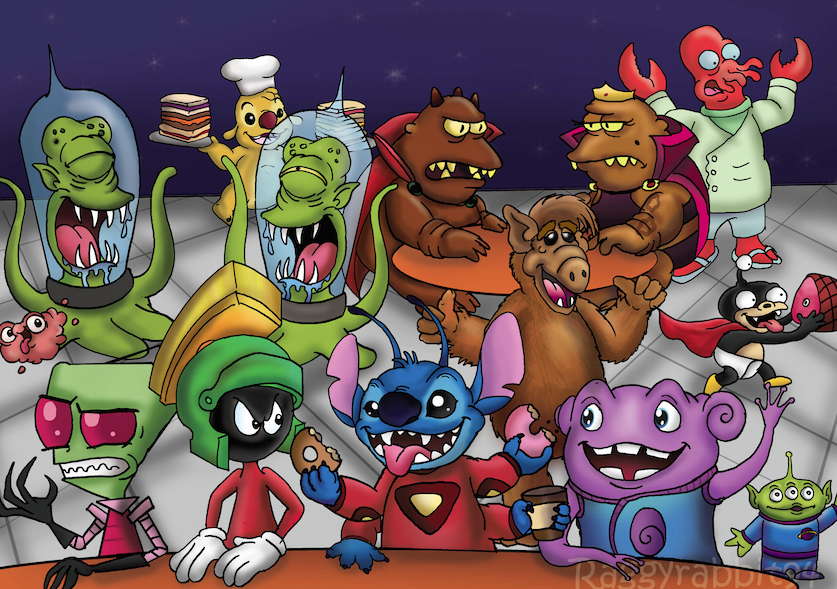

## MatCom Invasion

### Descripción

Los cielos oscuros sobre la Tierra anuncian una amenaza inminente: una invasión alienígena está en marcha. Los enemigos del espacio exterior han lanzado una ofensiva contra la Facultad de Matemática y Computación de la Universidad de la Habana, y la humanidad depende de tus habilidades para repeler la invasión. Te embarcarás en una peligrosa misión para defender nuestro hogar de los invasores alienígenas, usando tus habilidades tácticas y de combate para asegurar la supervivencia de la humanidad.

## Objetivo

Desarrollar un juego de estilo arcade en C, similar al clásico "Alien Invaders", donde el jugador controla una nave espacial para defender la Tierra de una invasión alienígena. Este proyecto tiene como objetivo principal poner en práctica conceptos fundamentales de programación, como la programación orientada a eventos, la concurrencia y el diseño de estrategias de planificación. Además, se busca familiarizar al estudiante con el entorno de desarrollo de una máquina virtual con sistema operativo Arch Linux.

## Elementos Teóricos

### Programación Orientada a Eventos

La implementación del juego requerirá el uso de programación orientada a eventos para manejar las interacciones del jugador con el entorno del juego. Esto implica detectar eventos como la entrada del teclado y responder a ellos de manera apropiada, como mover la nave del jugador o disparar proyectiles.

### Concurrencia Mediante Hilos

Para mejorar la experiencia del juego y gestionar múltiples aspectos simultáneamente, se utilizarán hilos para ejecutar tareas en paralelo. Por ejemplo, un hilo podría encargarse de escuchar los eventos, mientras que otro podría manejar la lógica del juego.

### Estrategias de Planificación

El diseño del juego incluirá la implementación de una estrategia de planificación para determinar cómo aparecen y se comportan los enemigos. Algunas estrategias podrían ser FIFO (First In, First Out), SJF (Shortest Job First), SRTN (Shortest Remaining Time Next), u otras relevantes, para garantizar una experiencia de juego desafiante pero justa.

### Dónde estará

Presentarás y defenderás tu proyecto en una máquina virtual con sistema operativo Arch Linux, demostrando tu comprensión y habilidades en un entorno de desarrollo coherente. Deberás ubicar el ejecutable de tu juego con los binarios del sistema. Este se debe ejecutar al escribir MatComInvasion en la consola.

# MatCom-Invasion
